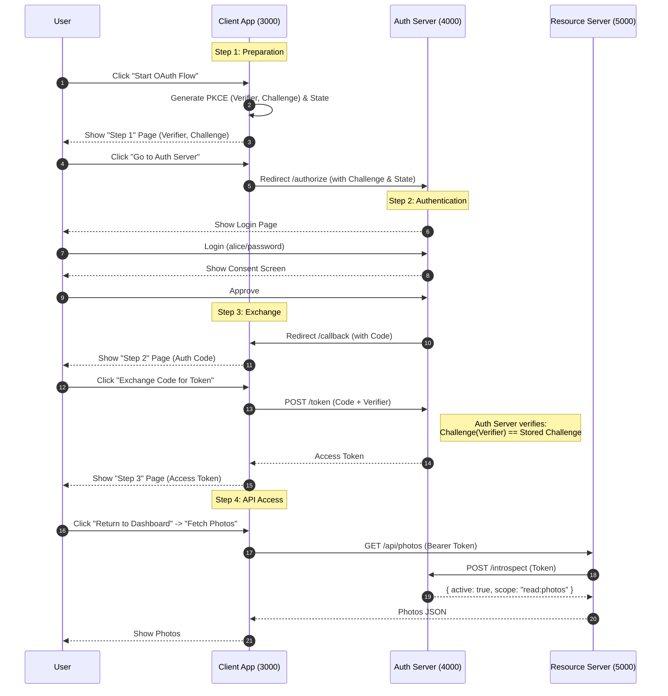

# OAuth 2.1 From Scratch (Educational)

A minimal, educational implementation of the **OAuth 2.1 Authorization Code Flow with PKCE**, demonstrating the interaction between a Client, Authorization Server, and Resource Server using Node.js.


> **Warning**: This code is for **educational purposes only**. It uses in-memory storage, hardcoded credentials, and HTTP (not HTTPS). Do not use in production.

## 🏗 Architecture

The project consists of three separate services running on different ports to simulate real-world trust boundaries:

| Service | Port | Description |
|---------|------|-------------|
| **Client App** | `3000` | The application the user wants to use (e.g., a photo printing service). |
| **Auth Server** | `4000` | The centralized authority that authenticates users and issues tokens. |
| **Resource Server** | `5000` | The API hosting the user's data (e.g., photos), protected by tokens. |

## 🚀 Quick Start

1. **Install Dependencies** (in all three directories via one command if you like, or individually):
   ```bash
   cd auth-server && npm install
   cd ../resource-server && npm install
   cd ../client && npm install
   ```

2. **Start the Services** (you need 3 separate terminals):

   **Terminal A (Auth Server)**
   ```bash
   cd auth-server
   npm start
   ```

   **Terminal B (Resource Server)**
   ```bash
   cd resource-server
   npm start
   ```

   **Terminal C (Client App)**
   ```bash
   cd client
   npm start
   ```

3. **Run the Educational Demo**:
   - Open [http://localhost:3000](http://localhost:3000) in your browser.
   - Click **"Start OAuth Flow"**.
   - **Step 1 (Client)**: Review the generated PKCE verifier and challenge. Click **"Go to Auth Server"**.
   - **Step 2 (Auth Server)**: Login with `alice` / `password`. Read the educational notes.
   - **Step 3 (Consent)**: Approve the access request.
   - **Step 4 (Client)**: You are back at the Client. Review the Authorization Code. Click **"Exchange Code for Token"**.
   - **Step 5 (Success)**: See the access token. Click **"Return to Dashboard"**.
   - **Step 6**: Click **"Fetch Photos"** to see data from the Resource Server.

## 🔄 Educational Flow Diagram


