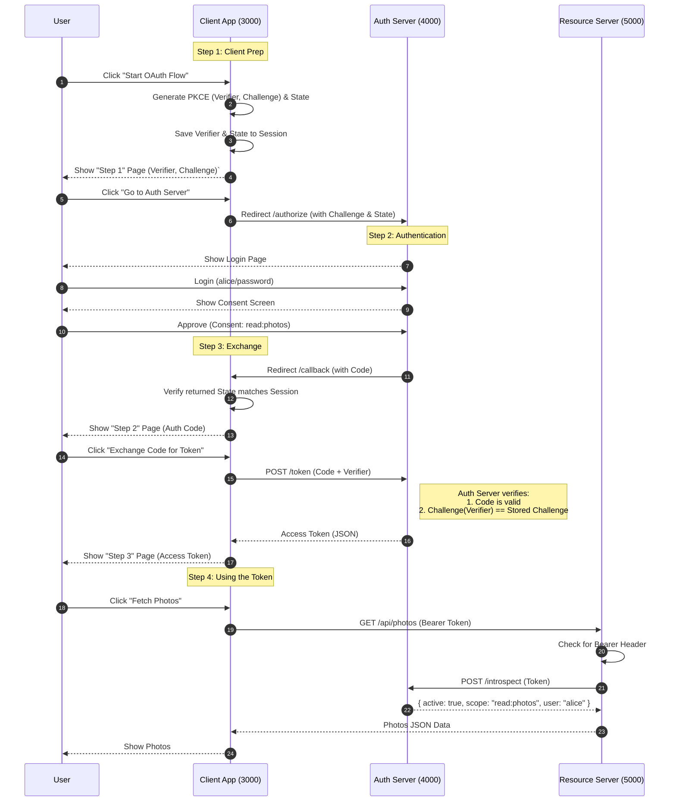

# OAuth 2.1 From Scratch (Educational)

A minimal, educational implementation of the **OAuth 2.1 Authorization Code Flow with PKCE**, designed to teach you exactly how modern authentication works under the hood.

> **Warning**: This code is for **educational purposes only**. It uses in-memory storage, hardcoded credentials, and HTTP (not HTTPS). Do not use in production.

## 🎓 The Theory: What are we building?

We are building the standard "Log in with..." flow you see everywhere.
In OAuth 2.1 terms, this is the **Authorization Code Flow with PKCE**.

### The Characters (Actors)
1.  **Resource Owner (You)**: The user who owns the photos.
2.  **Client (The App)**: The application that wants to print your photos (running on port `3000`).
3.  **Authorization Server (The Security Guard)**: The trusted server that holds your username/password and issues "keys" (tokens) (running on port `4000`).
4.  **Resource Server (The Vault)**: The API that actually holds the photos and only opens for valid keys (running on port `5000`).

### The Flow (The Story)
1.  **Client** asks **Auth Server**: "Hey, I need to access Alice's photos."
2.  **Auth Server** asks **User**: "Do you want to let this Client see your photos?"
3.  **User** says: "Yes."
4.  **Auth Server** gives **Client** a temporary access code.
5.  **Client** trades that code for a "Access Token".
6.  **Client** shows that Token to the **Resource Server** to get the photos.

---

## 🏗 Architecture & Setup

The project consists of three separate services running on different ports to simulate real-world trust boundaries.

### Prerequisites
- Node.js (v18+)

### 1. Installation
Run this one-liner to install dependencies for all three projects:
```bash
cd auth-server && npm install && cd ../resource-server && npm install && cd ../client && npm install && cd ..
```

### 2. Start the Services
You need **3 separate terminals** (or tabs):

**Terminal 1: Auth Server (Port 4000)**
```bash
cd auth-server
npm start
```

**Terminal 2: Resource Server (Port 5000)**
```bash
cd resource-server
npm start
```

**Terminal 3: Client App (Port 3000)**
```bash
cd client
npm start
```

### 3. Run the Educational Demo
1. Open [http://localhost:3000](http://localhost:3000).
2. Follow the step-by-step on-screen instructions.
   - We have added **"Pause Points"** where the app stops to show you the internal values (PKCE keys, State, Tokens).

---

## 🔑 Key Security Concepts Explained

### 1. PKCE (Proof Key for Code Exchange)
**The Problem**: In mobile apps, a malicious app could "listen" for the authorization code coming back from the browser.
**The Solution (PKCE)**:
1.  **Client** generates a secret password (`code_verifier`) and keeps it safe.
2.  **Client** hashes it (`code_challenge`) and sends the *hash* to the Auth Server initially.
3.  **Auth Server** remembers the hash.
4.  When the Client exchanges the code, it sends the *secret password*.
5.  **Auth Server** hashes the password. if `hash(password) == stored_hash`, it knows it's the same client.
*A malicious app interception the code won't know the secret password.*

### 2. State Parameter (CSRF Protection)
**The Problem**: An attacker starts a flow on *their* account and tricks you into clicking the final link. You end up linking *your* account to *their* Google.
**The Solution**:
1.  **Client** generates a random string (`state`) and saves it in your browser cookie.
2.  **Client** sends this `state` to the Auth Server.
3.  **Auth Server** sends it back unchanged.
4.  **Client** checks: `Does the state coming back match the one in the cookie?`
*If not, someone is trying to trick you.*

### 3. Token Introspection
**The Problem**: The Resource Server (Photos API) receives a random string "abc-123". It doesn't know what that means.
**The Solution**:
The Resource Server asks the Auth Server (the issuer): "Hey, is 'abc-123' a valid token? Who is it for? What permissions does it have?"
This is called **Introspection**.

---

## 🔄 Detailed Sequence Diagram



## 📦 Project Structure

```
oauth-from-scratch/
├── auth-server/         # Port 4000: Issues codes & tokens
│   ├── src/server.js    # Core logic (Login, Consent, PKCE, Token)
│   └── package.json
├── resource-server/     # Port 5000: Protected API
│   ├── src/server.js    # Middleware for token introspection
│   └── package.json
├── client/              # Port 3000: User-facing app
│   ├── src/server.js    # Handshake logic (Verifier, State, Exchange)
│   └── package.json
└── README.md
```
