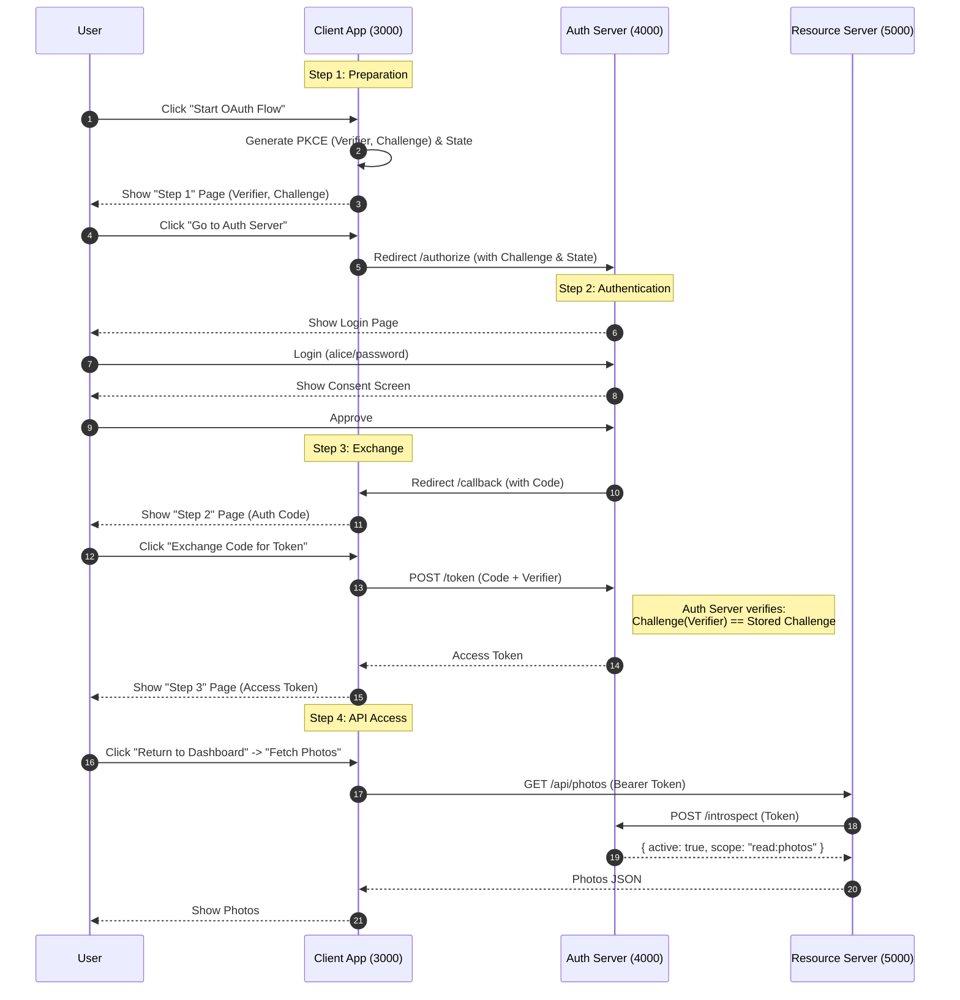

# OAuth 2.1 From Scratch (Educational)

A minimal, educational implementation of the **OAuth 2.1 Authorization Code Flow with PKCE**, demonstrating the interaction between a Client, Authorization Server, and Resource Server using Node.js.

![OAuth Flow](https://mermaid.ink/img/pako:eNqNVMtu2zAQ_BWCTwngwE-H3KwWaNBD0UvRSw8CLZE2E4lUSSqKEfhv75KU-BAlrdTDSJyd2R1yR1KplZAESfKx4nPJCt7w8y1jC45vCi7YivFV28D3jK1J1dCSbTjbsd2ObTm_5_yac44v2Q5fcL7m_J3tOJ_zv9mO8yXni23H-YrzJdvB94w_sR2-4nzN-SPbsf_E-SvbIZ9zvsx2_AXnK87XbEf_G9uh7zl_ZjvsP3H-xnbIOefLbEe64HzF-Zrt6D9hO4xtW7I601JJuRKaF0JzRcpC6f9ISi3Vv-3bB80lZ5W6VPIXJeVGqY_K0a_K-aP6h-ZfSslzXv9E07z8jZbK0P6JlmX5Gy210P6Jlkrq_4iWlfr3iJal_gdaVvo_oKWV4Q9oaaX_I1qW-m9oWZWfK8q1LItS3UutCqH_oGWl9R9oqbXRv9ByKf0bLSu9f6PlUvtPtFzK_0Yrh_mDLg9P_wOXh-f_gcuD1__Q5eH6P3B5cPofulyD_kOXXeX_0GXx5T90WUr9D12WwZ_QZan_oUutjC_osjL6gi5L7QtalsrnivJSF4XUv1TqhT6gy9LoC7osjb6gy9LoC7osjb6gy2L7gi6L7Qu6rIw-oMvS6AO6LI2-oMvi0xd0WZj9oMvS6AO6nKf_1GXp94Mui88f0OVy8wd0uaz9oMuy_oMui_UP6HIp_RtdltK_0XKp_6HLSv9Dl6X-hy5L_Q9dlvofuiwnf0KXVfIntFxWf0HLZe0XtCxnv6BlKfsFLSutX9Cy0voFLSutf9Cy0voFLau6fKHkWiilSikKqQuhH7Rcau0eLVeqeKe5UlUhtS71e6XvSi1LxY9aSiUVK7V81FKV5Uotv5eqLFZq-b1UZbFUy-8l5bJ4pVbfa6m0WKnl91ppobT5oVzK-y9aKq200fp7rbQUWmv9vVbaKKO1_l4rbaShtf5eK23U0lp_r5U2amt9XqFlvT6v0LJeP6_Qsl4_r9CyXj-v0LJeP6_Qsl4_r9CyXj-v0LJeP6_Qsl4_r9Cyrv-8Qsu6_vMKLev6zyu0rOs_r9Cyrv-8Qsu6_vMKLev6z3u0VNr8UC7k92fOpdJfX5TKfwFv_o5D?type=png)

> **Warning**: This code is for **educational purposes only**. It uses in-memory storage, hardcoded credentials, and HTTP (not HTTPS). Do not use in production.

## 🏗 Architecture

The project consists of three separate services running on different ports to simulate real-world trust boundaries:

| Service | Port | Description |
|---------|------|-------------|
| **Client App** | `3000` | The application the user wants to use (e.g., a photo printing service). |
| **Auth Server** | `4000` | The centralized authority that authenticates users and issues tokens. |
| **Resource Server** | `5000` | The API hosting the user's data (e.g., photos), protected by tokens. |

## 🚀 Quick Start

1. **Install Dependencies** (in all three directories via one command if you like, or individually):
   ```bash
   cd auth-server && npm install
   cd ../resource-server && npm install
   cd ../client && npm install
   ```

2. **Start the Services** (you need 3 separate terminals):

   **Terminal A (Auth Server)**
   ```bash
   cd auth-server
   npm start
   ```

   **Terminal B (Resource Server)**
   ```bash
   cd resource-server
   npm start
   ```

   **Terminal C (Client App)**
   ```bash
   cd client
   npm start
   ```

3. **Run the Educational Demo**:
   - Open [http://localhost:3000](http://localhost:3000) in your browser.
   - Click **"Start OAuth Flow"**.
   - **Step 1 (Client)**: Review the generated PKCE verifier and challenge. Click **"Go to Auth Server"**.
   - **Step 2 (Auth Server)**: Login with `alice` / `password`. Read the educational notes.
   - **Step 3 (Consent)**: Approve the access request.
   - **Step 4 (Client)**: You are back at the Client. Review the Authorization Code. Click **"Exchange Code for Token"**.
   - **Step 5 (Success)**: See the access token. Click **"Return to Dashboard"**.
   - **Step 6**: Click **"Fetch Photos"** to see data from the Resource Server.

## 🔄 Educational Flow Diagram


