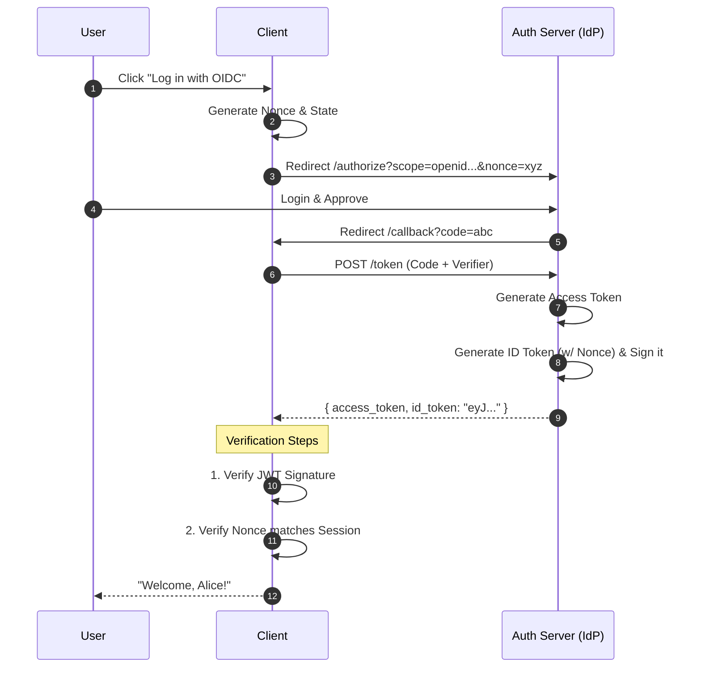

# OpenID Connect (OIDC) From Scratch (Educational)

A minimal, educational implementation of **OpenID Connect (OIDC)**, built on top of our OAuth 2.1 implementation.

> **Goal**: Understand how applications "Know who you are" (Identity) vs "What you can do" (Access).

## 🎓 The Theory: Identity vs. Access

- **OAuth 2.0/2.1** is about **Access**. "Give this app permission to *read my photos*." (The Key to the Mailbox).
- **OpenID Connect** is about **Identity**. "Tell this app *who I am*." (The ID Card).

### Key New Concepts

#### 1. ID Token (The Badge)
A **JWT (JSON Web Token)** that contains user information. Unlike the Access Token (which is opaque/random), the ID Token is meant to be read by the Client.
It is **signed** by the Auth Server so the Client knows it's real.

#### 2. The `openid` Scope
The magic word. When you include `scope=openid`, the Auth Server knows you want an ID Token.

#### 3. Nonce (Replay Protection)
A random string sent by the Client and baked into the ID Token. The Client checks it to ensure the token wasn't stolen from an earlier login.

---

## 🏗 Architecture

### 1. Auth Server (Identity Provider) (Port 4000)
- **New Role**: Acts as the Identity Provider (IdP).
- **Action**: When `scope` includes `openid`, it generates an ID Token signed with `HS256` (Simulated).
- **Key**: `educational-oidc-secret-key-change-me`

### 2. Client App (Relying Party) (Port 3000)
- **New Role**: The Relying Party (RP).
- **Action**:
  1. Sends `nonce` in authorization request.
  2. Receives `id_token`.
  3. **Verifies Signature** (is it from the Auth Server?).
  4. **Verifies Nonce** (is it for *this* session?).

---

## 🚀 How to Run

1.  **Install Dependencies** (in all 3 folders):
    ```bash
    cd auth-server && npm install
    cd ../client && npm install
    # (resource-server is standard, run npm install there too)
    ```

2.  **Start Services** (3 Terminals):
    *   `auth-server`: `npm start` (Port 4000)
    *   `client`: `npm start` (Port 3000)
    *   `resource-server`: `npm start` (Port 5000)

3.  **Demo**:
    *   Go to [http://localhost:3000](http://localhost:3000).
    *   Click "Log in with OIDC".
    *   Login as `alice` / `password`.
    *   **Observe**: The Consent screen now says "verify your identity".
    *   **Success**: The Client displays your Name, Email, and the raw ID Token.

---

## 🔄 Sequence Diagram


